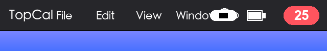
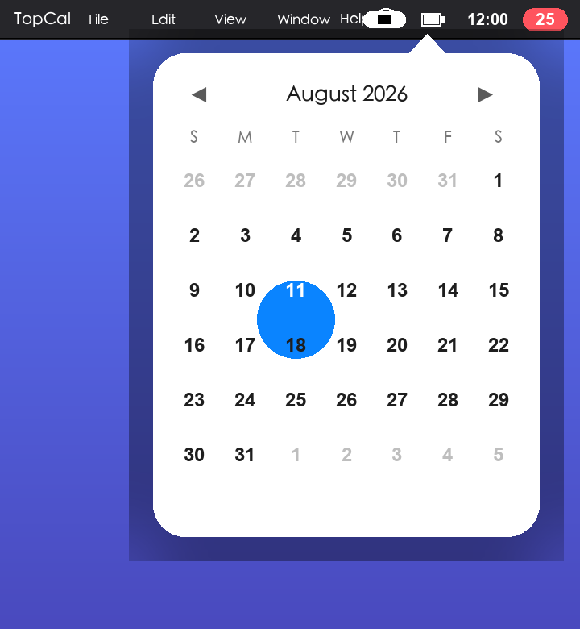

# TopCal

<div align="center">
  
</div>

A minimal macOS menu bar calendar. Shows today's day-of-month in the menu bar; click it to view a popover calendar with month/year navigation.

  

**TopCal** — a tiny calendar that lives in your menu bar. Click it, see the month, get back to work.

<p align="center">
  
</p>

## Features

- 📅 Current day-of-month shown in the menu bar (e.g. `25`)
- 🗓 Click to open a popover calendar — current day is highlighted
- ◀ ▶ Month/year navigation inside the popover
- 🐉 Lunar (Chinese) calendar overlay in Chinese locales — each cell shows the
  traditional `初一` … `三十` date and labels the first day of each lunar month
- 🌍 Localized: English · Simplified Chinese · Traditional Chinese · Japanese · Korean · German · French · Spanish
- 🚀 Launch at login (via per-user LaunchAgent, no helper app required)
- 🔔 Optional launch notification to confirm the app is running
- ⚡ Native AppKit, no dependencies, no sandbox account needed

<p align="center">
  
</p>

## Requirements

- macOS 13.0 or later (arm64 / x86_64)
- Xcode Command Line Tools (`xcode-select --install`) to build from source

## Installation

Download the latest `TopCal.app` from [Releases](../../releases) and drag it into your **Applications** folder, then launch it.

> First launch: the app registers itself as a login item and may ask for
> notification permission — these are optional and can be denied.

### macOS Gatekeeper / "Apple cannot check it for malicious software"

TopCal is **ad-hoc signed** (no paid Apple Developer ID), so macOS may block the
first launch. This is normal for free open-source apps. Remove the quarantine
flag in Terminal and it will open normally:

```bash
# 1. Move the app into /Applications first, then remove the quarantine flag:
xattr -dr com.apple.quarantine /Applications/TopCal.app
# 2. Launch it:
open /Applications/TopCal.app
```

## Build from Source

```bash
git clone https://github.com/zhengwu119/TopCal.git TopCal
cd TopCal
./build.sh
open build/TopCal.app
```

Or manually:

```bash
swiftc -o TopCal.app/Contents/MacOS/TopCal \
  -framework AppKit -framework Foundation -framework UserNotifications \
  $(find Sources -name "*.swift" | sort)
cp Info.plist TopCal.app/Contents/Info.plist
cp AppIcon.icns TopCal.app/Contents/Resources/AppIcon.icns
cp -R *.lproj TopCal.app/Contents/Resources/
codesign --force --deep --sign - TopCal.app
```

## Usage

- The menu bar shows today's date. Click it to toggle the calendar popover.
- Click `◀` / `▶` inside the popover to switch months.
- Click anywhere outside the popover to close it.
- The interface follows your system language automatically (no setting needed).
- In Chinese locales (Simplified or Traditional) each cell also shows the
  lunar date (`初一`–`三十`, with month names like `七月` on the 1st). Adjacent
  months appear dimmed to keep the current month prominent.

## Uninstall

```bash
# 1. Remove the login item
launchctl bootout gui/$(id -u) ~/Library/LaunchAgents/com.topcal.app.plist
rm ~/Library/LaunchAgents/com.topcal.app.plist

# 2. Quit and delete the app
pkill TopCal
rm -rf /Applications/TopCal.app
```

## How It Works

- **Status bar icon**: the day-of-month is rendered into an `NSImage` and set on
  the `NSStatusBarButton` — more reliable than `button.title` on recent macOS.
- **Popover**: an `NSPopover` with `.transient` behavior (auto-closes on outside click).
- **Lunar calendar**: uses Foundation's `Calendar(identifier: .chinese)` to compute
  the traditional month / day / leap-month for any Gregorian date. Displayed
  only in Chinese locales; other locales see the plain Gregorian grid.
- **Localization**: `*.lproj` bundles (8 languages) provide notifications, the
  month header format, and the localized display name. Weekday headers use
  `Calendar`'s localized symbols aligned to the first weekday.
- **Launch at login**: writes a `LaunchAgent` plist to `~/Library/LaunchAgents`
  and loads it via `launchctl bootstrap` — works with ad-hoc signing, no
  Developer ID or helper app required.
- **Entry point**: `main.swift` uses explicit top-level code instead of `@main`
  because `@main` on `NSApplicationDelegate` subclasses silently fails on
  macOS 26 / Swift 6.2 (see comment in `main.swift`).

## Project Structure

```
├── Sources/
│   ├── main.swift                      # Explicit app entry point (NOT @main)
│   ├── AppDelegate.swift               # Thin wiring: status item + popover + timer
│   ├── AppConstants.swift              # All tunable constants
│   ├── Calendar/
│   │   ├── CalendarViewController.swift  # Popover UI + navigation
│   │   ├── MonthGrid.swift              # Pure data model with adjacent-month cells
│   │   └── LunarCalendar.swift          # Chinese lunar date helpers
│   ├── LaunchAtLogin/
│   │   └── LaunchAtLoginManager.swift   # LaunchAgent install/remove
│   ├── Notifications/
│   │   └── NotificationManager.swift    # UserNotifications wrapper
│   └── Support/
│       └── StatusBarIconRenderer.swift  # Renders day number into NSImage
├── *.lproj/                             # Localization (8 languages)
├── AppIcon.icns / icon.png              # App icon (generated by scripts/make_icon.py)
├── docs/                                # Per-locale README screenshots
│   ├── en/                              #   English (no lunar overlay)
│   │   ├── screenshot-menu.png
│   │   └── screenshot-popover.png
│   └── zh-Hans/                         #   Simplified Chinese (with lunar dates)
│       ├── screenshot-menu.png
│       └── screenshot-popover.png
├── Info.plist                           # Bundle config (LSUIElement, localizations, icon)
├── scripts/
│   ├── make_icon.py                     # Regenerate AppIcon.icns from icon.png
│   └── make_screenshots.py              # Regenerate README screenshots
├── build.sh                             # One-command local build
├── .github/workflows/
│   ├── build.yml                        # CI: compile + signature verification
│   └── release.yml                      # CI: tag → universal build → GitHub Release
├── LICENSE, README.md, README.zh-CN.md, CHANGELOG.md
```

## Contributing

Issues and pull requests are welcome! Please make sure:

1. Code compiles with `./build.sh`
2. No new `print()` debug output in release code — use `os_log` if needed
3. When adding a string, add translations to every `*.lproj/Localizable.strings`
4. Keep changes focused and documented

## License

[MIT](LICENSE) © Alex Liu