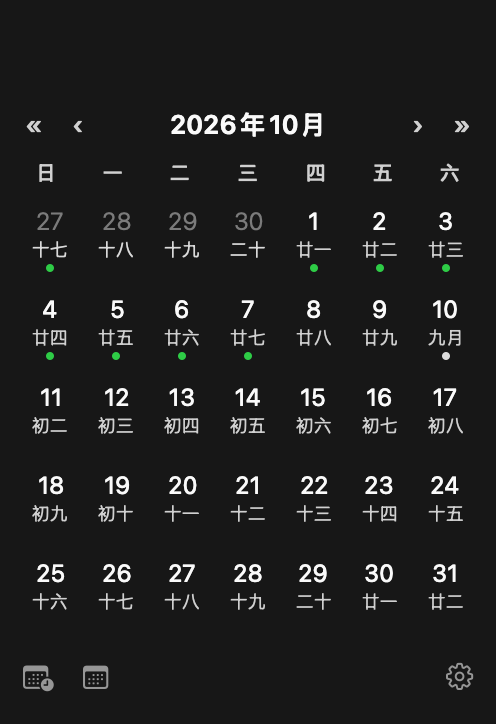

# TopCal · 顶历

<div align="center">
  
</div>

🌐 **语言：** 🇺🇸 [English](README.md) · 🇨🇳 [简体中文](README.zh-CN.md) · 🇯🇵 日本語 · 🇰🇷 한국어 · 🇩🇪 Deutsch · 🇫🇷 Français · 🇪🇸 Español &nbsp;_（欢迎贡献翻译 — 见 [参与贡献](#参与贡献)）_

一个极简的 macOS 顶部菜单栏日历：菜单栏显示今天的日期，点击弹出当月日历，支持月份/年份切换。

  

**顶历** —— 顶部的日历：名字即功能，一眼看出它是常驻在顶部菜单栏的日历组件。

<p align="center">
  
</p>

## 功能

- 📅 顶部菜单栏显示今天的日期（如 `25`）
- 🗓 点击弹出当月日历，当天高亮
- ◀ ▶ 弹窗内支持月份切换
- 🐉 **农历显示**（默认开启）：每个格子下方显示农历日（`初一`～`三十`），初一自动显示月份名（`正月`、`二月`...）
- 🗓 **上月/下月日期灰色显示**，让当月更突出
- ◀ ▶ 月份切换 + « » **年份**切换（SF Symbols 细线箭头）
- 🧮 **日历工具栏**：
  - **工作日**：选择两个日期，算出工作日数量（扣除法定节假日，包含调休补班日）
  - **天数**：选择两个日期，算出总天数（含首尾）
- ⚙️ **设置菜单**（右下角齿轮图标）：
  - **语言切换**（English · 简体中文 · 繁體中文 · 日本語 · 한국어 · Deutsch · Français · Español，记住偏好）
  - **检查更新**（查询 GitHub 最新 Release，对比本地版本）
  - **关于**
- 📌 **法定节假日与调休标记**（默认开启）：
  - **绿色圆点** = 法定节假日（国务院公布的放假日期）
  - **中性圆点（黑/白自动适配）** = 调休上班日（周末补班）
  - 普通周末不做特殊标记
- 🌍 多语言：English · 简体中文 · 繁體中文 · 日本語 · 한국어 · Deutsch · Français · Español
- 🚀 开机自启（通过 LaunchAgent，无需辅助应用）
- 🔔 启动通知（可选，需授予通知权限）
- ⚡ 原生 AppKit 实现，无第三方依赖

<p align="center">
  
</p>

## 系统要求

- macOS 13.0 及以上（arm64 / x86_64）
- 从源码构建需要 Xcode Command Line Tools（`xcode-select --install`）

## 安装

从 [Releases](../../releases) 下载最新的 `TopCal.app`，拖入 **应用程序** 文件夹后运行。

> 首次启动时应用会注册开机自启项，并可能请求通知权限——两者都可拒绝。

### macOS Gatekeeper（"无法验证是否包含恶意软件"）

TopCal 使用 **ad-hoc 签名**（无付费 Apple Developer ID），macOS 首次打开时可能拦截。免费开源应用都会遇到，正常现象。在终端执行以下命令即可正常打开：

```bash
# 1. 先把 App 拖入"应用程序"文件夹，再移除隔离标记
#    （/Applications 目录普通用户无写权限，需要 sudo）：
sudo xattr -dr com.apple.quarantine /Applications/TopCal.app
# 2. 启动：
open /Applications/TopCal.app
```

## 从源码构建

```bash
git clone https://github.com/zhengwu119/TopCal.git TopCal
cd TopCal
./build.sh
open build/TopCal.app
```

或手动编译：

```bash
swiftc -o TopCal.app/Contents/MacOS/TopCal \
  -framework AppKit -framework Foundation -framework UserNotifications \
  $(find Sources -name "*.swift" | sort)
cp Info.plist TopCal.app/Contents/Info.plist
cp AppIcon.icns TopCal.app/Contents/Resources/AppIcon.icns
cp -R *.lproj TopCal.app/Contents/Resources/
codesign --force --deep --sign - TopCal.app
```

## 使用

- 菜单栏显示今天日期，点击切换日历弹窗
- 弹窗内点击 `◀` / `▶` 切换月份
- 点击弹窗外任意位置关闭
- 界面语言自动跟随系统语言，无需设置
- 农历叠加和法定节假日/调休标记**默认开启**，不依赖系统语言
- **中文环境下农历自动启用**，每个格子下方显示农历日
- 上月/下月日期**灰色**显示，让当月更醒目
- 法定节假日格子底部有**绿色圆点**；调休补班日有**中性圆点**（黑白主题自适应）；普通周末无标记
- 用 « / » 跳整年；‹ / › 切月份
- 底部工具栏：点**工作日**（扣法定节假日，含调休），或**天数**（含首尾）；点日历上两个日期即可在工具栏内看到结果

## 卸载

```bash
# 1. 移除开机自启
launchctl bootout gui/$(id -u) ~/Library/LaunchAgents/com.topcal.app.plist
rm ~/Library/LaunchAgents/com.topcal.app.plist

# 2. 退出并删除应用
pkill TopCal
rm -rf /Applications/TopCal.app
```

## 实现原理

- **菜单栏图标**：将日期数字绘制成 `NSImage` 设置到 `NSStatusBarButton`——比 `button.title` 在新版 macOS 上更可靠
- **弹窗**：`NSPopover` + `.transient` 行为（点击外部自动关闭）
- **农历**：使用 Foundation 的 `Calendar(identifier: .chinese)` 计算传统月日/闰月，仅在中文环境下显示；其他语言看到纯公历网格
- **本地化**：`*.lproj` 资源包（8 种语言）提供通知文案、月份标题格式和本地化应用名；星期标题使用 `Calendar` 的本地化符号并按每周起始日对齐
- **开机自启**：向 `~/Library/LaunchAgents` 写入 LaunchAgent plist，用 `launchctl bootstrap` 加载——支持 ad-hoc 签名，无需开发者账号或辅助应用
- **入口**：`main.swift` 使用显式顶层代码而非 `@main`，因为 macOS 26 / Swift 6.2 上 `@main` 在 `NSApplicationDelegate` 子类上会静默失败（详见 `main.swift` 注释）

## 项目结构

```
├── Sources/
│   ├── main.swift                      # 显式应用入口（不使用 @main）
│   ├── AppDelegate.swift               # 薄装配层：状态栏 + 弹窗 + 定时器
│   ├── AppConstants.swift              # 所有可调参数集中一处
│   ├── Calendar/
│   │   ├── CalendarViewController.swift  # 弹窗 UI + 月份切换
│   │   ├── MonthGrid.swift              # 纯数据模型（含邻月格子）
│   │   └── LunarCalendar.swift          # 农历计算
│   ├── LaunchAtLogin/
│   │   └── LaunchAtLoginManager.swift   # LaunchAgent 安装/移除
│   ├── Notifications/
│   │   └── NotificationManager.swift    # UserNotifications 封装
│   └── Support/
│       └── StatusBarIconRenderer.swift  # 把日期数字画成 NSImage
├── *.lproj/                             # 多语言资源（8 种语言）
├── AppIcon.icns / icon.png              # 应用图标（scripts/make_icon.py 生成）
├── docs/                                # 各语言 README 截图
│   ├── en/                              #   英文（无农历）
│   │   ├── screenshot-menu.png
│   │   ├── screenshot-popover.png       #    ← 真实 AppKit 渲染
│   │   └── menubar-icon.png             #    ← 真实 AppKit 渲染
│   └── zh-Hans/                         #   简体中文（含农历）
│       ├── screenshot-menu.png
│       ├── screenshot-popover.png       #    ← 真实 AppKit 渲染
│       └── menubar-icon.png             #    ← 真实 AppKit 渲染
├── Info.plist                           # Bundle 配置（LSUIElement、本地化、图标）
├── scripts/
│   ├── make_icon.py                     # 从 icon.png 重新生成 AppIcon.icns
│   ├── make_screenshots.py              # 用真实图标合成菜单栏图
│   └── render/                          # 离屏 AppKit 渲染工具（详见 build.sh）
│       ├── main.swift
│       ├── Info.plist
│       └── build.sh
├── build.sh                             # 本地一键构建
├── .github/workflows/
│   ├── build.yml                        # CI：编译 + 签名校验
│   └── release.yml                      # CI：tag → 通用版构建 → GitHub Release
├── LICENSE、README.md、README.zh-CN.md、CHANGELOG.md
```

## 参与贡献

欢迎提交 Issue 和 PR！请确保：

1. 代码能通过 `./build.sh` 编译
2. 发布代码中不要新增 `print()` 调试输出——如需日志请使用 `os_log`
3. 新增文案时，请同步补充所有 `*.lproj/Localizable.strings` 的翻译
4. 改动聚焦且附说明

## 开源协议

[MIT](LICENSE) © Alex Liu